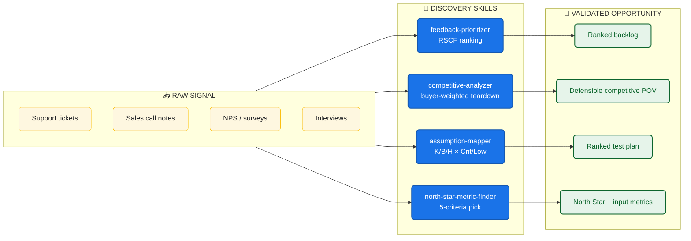

<div align="center">

# 🎯 AI Customer Discovery Skills

### Turn raw customer signal into validated product opportunities - in minutes, not weeks

[](#-skills-catalog)
[](#-roadmap)
[](LICENSE)
[](https://claude.ai/code)
[](https://github.com/features/copilot)

**Maintained by [Varun Kulkarni](https://github.com/varunk130)**

</div>

---

## 🔭 The Discovery Flywheel



---

## Why This Library Exists

Customer discovery is the first place product work goes wrong: signals get cherry-picked, opportunities get sized by gut feel, and personas get over-fitted to whoever shouted loudest in the last interview. This library captures the structured workflows that turn raw signal into evidence - each skill is a self-contained markdown file that any compatible AI agent can load on demand.

---

## ⚡ Quickstart

```bash
# 1. Clone the repo
git clone https://github.com/varunk130/ai-customer-discovery-skills.git

# 2. Install skills globally for Claude Code
mkdir -p ~/.claude/skills
cp -r ai-customer-discovery-skills/skills/* ~/.claude/skills/

# 3. Restart Claude Code, then run a skill:
#      /feedback-prioritizer        — triage a backlog of support tickets
#      /competitive-analyzer        — score competitors on buyer dimensions
#      /assumption-mapper           — surface and rank bet-killing assumptions
#      /north-star-metric-finder    — pick a 2-year-horizon north star
```

**GitHub Copilot users:** copy the same `skills/` directory into `.github/skills/` in any repo and invoke via natural language.

**Project-local install:** drop the skills into `.claude/skills/` inside your project to scope them to one codebase.

---

## 📋 Skills Catalog

| Skill | What it does | Use when |
|-------|--------------|----------|
| [feedback-prioritizer](skills/feedback-prioritizer/SKILL.md) | Triages raw customer feedback into a ranked list using the RSCF model, with an explicit `Do Not Act` list for vocal-minority signals | A backlog of tickets / interviews / NPS / sales notes is piling up and the team needs focus |
| [competitive-analyzer](skills/competitive-analyzer/SKILL.md) | Runs a disciplined competitive teardown - picks 4-6 buyer-weighted dimensions, scores every competitor, and surfaces gap + risk maps | You need a defensible competitive analysis that changes a decision, not a 40-row feature grid |
| [assumption-mapper](skills/assumption-mapper/SKILL.md) | Surfaces hidden assumptions, classifies them Known / Believed / Hoped × Critical / High / Medium / Low, and outputs a ranked test plan | You're about to commit real investment to a bet and need to know what could kill it first |
| [north-star-metric-finder](skills/north-star-metric-finder/SKILL.md) | Identifies a candidate North Star Metric using five strict criteria, then maps the input metrics that drive it | You're picking the single metric that will steer two years of roadmap decisions |

---

## 🗺 Roadmap

4 of 12 skills shipped. Additional skills planned: persona-validator, jtbd-mapper, opportunity-sizer, switch-cost-analyzer, willingness-to-pay-tester, and more. Watch this repo for releases.

---

## Related Work

Part of a portfolio of AI agent and skill libraries for product, GTM, and decision-making teams.

**Discovery & research**

- [jtbd-extractor](https://github.com/varunk130/jtbd-extractor) - Extract Jobs-to-be-Done statements from research, with opportunity scoring

**Strategy & decisions**

- [claude-code-skills](https://github.com/varunk130/claude-code-skills) - 29 production-grade skills for finance, product, strategy, and game theory
- [AI-Builder-Decision-Analyst](https://github.com/varunk130/AI-Builder-Decision-Analyst) - 11 skills that catch bad bets before you ship across DECIDE / BUILD / COMMUNICATE / LEARN
- [pm-copilots](https://github.com/varunk130/pm-copilots) - 4 PM copilots - stakeholder translation, decision engine, financial analyst, roadmap architect

**Go-to-market**

- [ai-gtm-skill-library](https://github.com/varunk130/ai-gtm-skill-library) - 31 opinionated GTM skills across the full discover -> renew lifecycle
- [ai-marketing-claude-skills](https://github.com/varunk130/ai-marketing-claude-skills) - 12 marketing-ops skills with scoring algorithms and statistical frameworks
- [ai-partner-ecosystem-analysis](https://github.com/varunk130/ai-partner-ecosystem-analysis) - Deep research on any ISV, partner, or competitor with a 1-slide PPTX output

**UX & design**

- [ai-ux-skill-library](https://github.com/varunk130/ai-ux-skill-library) - 12 frameworks for designing UX for AI products, agents, and AI-powered experiences

**Multi-agent demos**

- [multi-ai-agent-pm-team](https://github.com/varunk130/multi-ai-agent-pm-team) - 6-agent React pipeline that turns customer feedback into executive-ready strategy
- [ai-legal-team-agent](https://github.com/varunk130/ai-legal-team-agent) - 4-agent legal analysis team with Python orchestrator and Claude Code skills

**Evaluation & operations**

- [AI-Eval-Skills](https://github.com/varunk130/AI-Eval-Skills) - 6 skills to plan, generate, run, interpret, and triage AI agent evaluations
- [ai-workflow-playbooks](https://github.com/varunk130/ai-workflow-playbooks) - 21 playbooks + 10 skills + 4 guardians + 5 runbooks across the 7-stage delivery pipeline

---

## License

[MIT](LICENSE) — use freely, attribution appreciated.
