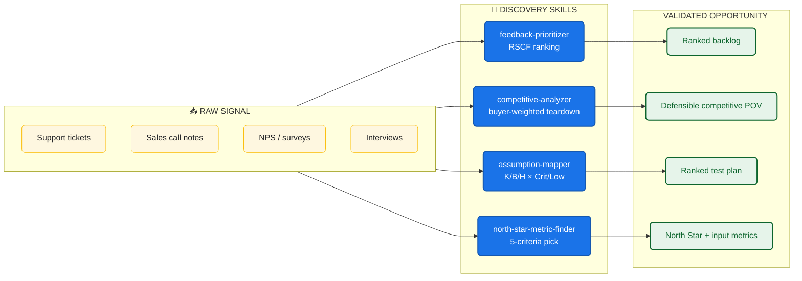

<div align="center">

# 🎯 AI Customer Discovery Skills

### Turn raw customer signal into validated product opportunities — in minutes, not weeks

[](#-skills-catalog)
[](#-roadmap)
[](LICENSE)
[](https://claude.ai/code)
[](https://github.com/features/copilot)

**Maintained by [Varun Kulkarni](https://github.com/varunk130)**

</div>

---

## 🔭 The Discovery Flywheel



---

## Why This Library Exists

Customer discovery is the first place product work goes wrong: signals get cherry-picked, opportunities get sized by gut feel, and personas get over-fitted to whoever shouted loudest in the last interview. This library captures the structured workflows that turn raw signal into evidence — each skill is a self-contained markdown file that any compatible AI agent can load on demand.

---

## ⚡ Quickstart

```bash
# 1. Clone the repo
git clone https://github.com/varunk130/ai-customer-discovery-skills.git

# 2. Install skills globally for Claude Code
mkdir -p ~/.claude/skills
cp -r ai-customer-discovery-skills/skills/* ~/.claude/skills/

# 3. Restart Claude Code, then run a skill:
#      /feedback-prioritizer        — triage a backlog of support tickets
#      /competitive-analyzer        — score competitors on buyer dimensions
#      /assumption-mapper           — surface and rank bet-killing assumptions
#      /north-star-metric-finder    — pick a 2-year-horizon north star
```

**GitHub Copilot users:** copy the same `skills/` directory into `.github/skills/` in any repo and invoke via natural language.

**Project-local install:** drop the skills into `.claude/skills/` inside your project to scope them to one codebase.

---

## 📋 Skills Catalog

| Skill | What it does | Use when |
|-------|--------------|----------|
| [competitive-analyzer](skills/competitive-analyzer/SKILL.md) | Disciplined competitive teardown that picks the 4–6 buyer-weighted dimensions, scores every competitor, and surfaces gap + risk maps | You need a defensible competitive analysis that changes a decision, not a 40-row feature grid |
| [north-star-metric-finder](skills/north-star-metric-finder/SKILL.md) | Identifies a candidate North Star Metric using five strict criteria, then maps the input metrics that drive it | You're picking the single metric that will steer two years of roadmap decisions |
| [feedback-prioritizer](skills/feedback-prioritizer/SKILL.md) | Triages raw customer feedback into a ranked list using the RSCF model, with an explicit `Do Not Act` list for vocal-minority signals | A backlog of tickets / interviews / NPS / sales notes is piling up and the team needs focus |
| [assumption-mapper](skills/assumption-mapper/SKILL.md) | Surfaces hidden assumptions, classifies them Known / Believed / Hoped × Critical–Low, and outputs a ranked test plan | You're about to commit real investment to a bet and need to know what could kill it first |

---

## 🗺 Roadmap

4 of 12 skills shipped. Additional skills planned: persona-validator, jtbd-mapper, opportunity-sizer, switch-cost-analyzer, willingness-to-pay-tester, and more. Watch this repo for releases.

---

## License

[MIT](LICENSE) — use freely, attribution appreciated.
