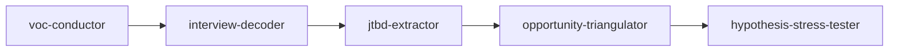

<div align="center">

# 🎯 ai-customer-discovery-skills

**12 AI skills for product discovery — from raw customer signal to validated opportunity.**

*Built for Claude Code, GitHub Copilot, and any agent runtime that speaks the SKILL.md format.*

[](https://opensource.org/licenses/MIT)
[](CONTRIBUTING.md)
[](https://www.anthropic.com/claude-code)
[](https://github.com/features/copilot)


[Quickstart](#-quickstart) • [Skills](#-the-12-skills) • [Architecture](docs/architecture.md) • [Workflows](docs/workflows/) • [Contributing](CONTRIBUTING.md)

</div>

---

## ✨ Why this exists

Most product discovery libraries are flat collections of prompts. They produce inconsistent outputs because every skill assumes a different input. This library enforces a **contract**: every skill''s output is a valid input for at least one downstream skill. That makes pipelines reliable.

It is opinionated about the path:

```
RAW CUSTOMER SIGNAL  →  CODED INSIGHT  →  VALIDATED OPPORTUNITY
      (capture)             (synthesize)         (decide)
```

Every skill belongs to one of these three layers. See [`docs/architecture.md`](docs/architecture.md) for the mental model.

---

## 📚 Table of contents

- [Why this exists](#-why-this-exists)
- [The 12 skills](#-the-12-skills)
- [Quickstart](#-quickstart)
- [Workflow recipes](#-workflow-recipes)
- [Project layout](#-project-layout)
- [Contributing](#-contributing)
- [Roadmap](#-roadmap)
- [License](#-license)

---

## 🧰 The 12 skills

### Layer 1 — Capture *(raw signal → structured data)*

| Skill | What it does |
|---|---|
| 🏛️ [`signal-archaeologist`](skills/signal-archaeologist/) | Mines historical tickets/calls/NPS for buried signals with velocity scoring |
| 🎙️ [`interview-decoder`](skills/interview-decoder/) | Decodes a single interview into themes, contradictions, and follow-ups |
| 🎼 [`voc-conductor`](skills/voc-conductor/) | Aggregates VoC streams across channels with channel-reliability weighting |
| 📐 [`discovery-question-architect`](skills/discovery-question-architect/) | Generates bias-checked open-ended question banks |

### Layer 2 — Synthesize *(structured data → coded insight)*

| Skill | What it does |
|---|---|
| 🗺️ [`persona-cartographer`](skills/persona-cartographer/) | Maps personas as a relationship graph, not isolated cards |
| 🎯 [`jtbd-extractor`](skills/jtbd-extractor/) | Extracts functional, emotional, and social JTBDs with opportunity scoring |
| 👣 [`journey-shadower`](skills/journey-shadower/) | Hour-by-hour journey simulation with friction scoring |
| 🧪 [`insight-distiller`](skills/insight-distiller/) | Multi-source synthesis with confidence intervals and source trails |

### Layer 3 — Decide *(insight → validated opportunity)*

| Skill | What it does |
|---|---|
| 🔮 [`problem-prism`](skills/problem-prism/) | Refracts a problem through 5 lenses to widen the option space |
| 📊 [`opportunity-triangulator`](skills/opportunity-triangulator/) | Sizes opportunity using 3 independent methods + spread analysis |
| ⛏️ [`assumption-excavator`](skills/assumption-excavator/) | Surfaces hidden assumptions in a brief, ranked by test × failure cost |
| ⚔️ [`hypothesis-stress-tester`](skills/hypothesis-stress-tester/) | Adversarially attacks a hypothesis from 6 angles |

---

## 🚀 Quickstart

**Prerequisites**: [Claude Code](https://www.anthropic.com/claude-code), [GitHub Copilot CLI](https://docs.github.com/en/copilot), or any agent runtime that supports SKILL.md.

```bash
git clone https://github.com/varunk130/ai-customer-discovery-skills.git
cd ai-customer-discovery-skills

# In Claude Code:
> Use the interview-decoder skill on examples/saas-onboarding-research/transcript-01.md
```

Full guide: [`docs/getting-started.md`](docs/getting-started.md).

---

## 🧩 Workflow recipes

Skills compose. A typical end-to-end discovery cycle uses 4–6 skills:



Canonical recipes in [`docs/workflows/`](docs/workflows/):

- 🏃 [Quick discovery sprint](docs/workflows/) — 3 skills, 1 day
- 🔄 [Churn root-cause analysis](docs/workflows/) — 5 skills, 1 week
- 📈 [New opportunity validation](docs/workflows/) — 7 skills, 2 weeks

---

## 🗂️ Project layout

```
ai-customer-discovery-skills/
├── skills/                   # 12 skill specs (SKILL.md + examples)
├── docs/                     # architecture, getting started, workflows
├── examples/                 # end-to-end worked examples
├── scripts/                  # SKILL.md schema validator
├── .github/                  # issue & PR templates, CI workflows
├── CONTRIBUTING.md           # branching, conventions, review process
├── CODE_OF_CONDUCT.md
├── SECURITY.md
├── CHANGELOG.md
└── LICENSE                   # MIT
```

---

## 🤝 Contributing

Contributions are welcome and encouraged. Read [`CONTRIBUTING.md`](CONTRIBUTING.md) before opening a PR — it covers branching, commit conventions, the SKILL.md schema, and the review process.

> **Heads up**: The `main` branch is protected. All changes go through Pull Requests, require 1 maintainer approval, and must pass CI (lint + link check + schema validator).

Good places to start:

- 🌱 Issues labeled [`good first issue`](https://github.com/varunk130/ai-customer-discovery-skills/labels/good%20first%20issue)
- 🗺️ Roadmap items labeled [`roadmap`](https://github.com/varunk130/ai-customer-discovery-skills/labels/roadmap)
- 💬 Open RFCs in [Discussions](https://github.com/varunk130/ai-customer-discovery-skills/discussions)

---

## 🗺️ Roadmap

Tracked publicly in [Issues with the `roadmap` label](https://github.com/varunk130/ai-customer-discovery-skills/labels/roadmap). Highlights:

- `competitive-analyzer` — competitive landscape from public signals
- `survey-designer` — bias-checked quantitative surveys
- `kano-model-classifier` — Kano analysis on feature ideas
- `north-star-metric-finder` — derive a single NSM from JTBDs and outcomes
- `feedback-prioritizer` — RICE/ICE prioritization with evidence trail

---

## 📄 License

MIT — see [`LICENSE`](LICENSE).

---

<div align="center">

**Built by [Varun Kulkarni](https://github.com/varunk130)** — PM at Microsoft, working on M365 Copilot Ecosystems.

If this saved you time, a ⭐ helps others find it.

</div>