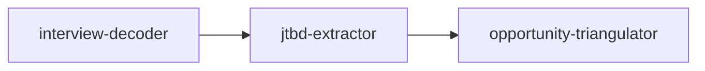
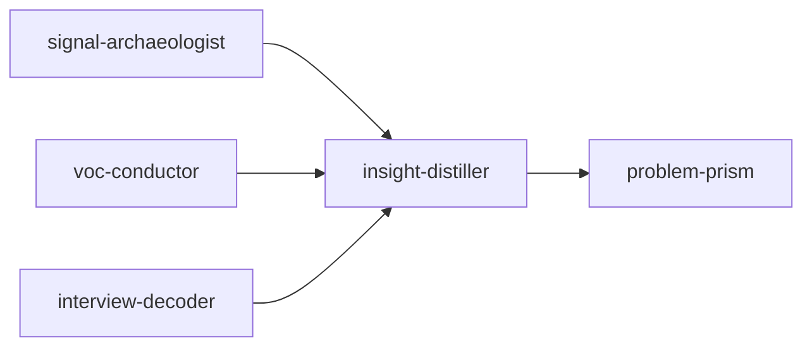
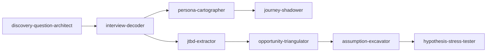

# Workflow recipes

Skills are designed to compose. These recipes are battle-tested combinations.

- [Quick discovery sprint](#quick-discovery-sprint) — 3 skills
- [Churn root-cause analysis](#churn-root-cause-analysis) — 5 skills
- [New opportunity validation](#new-opportunity-validation) — 7 skills

---

## Quick discovery sprint

**When**: You ran a small batch of interviews and need actionable output today.

**Prerequisites**: 3–5 transcripts.

**Artefacts produced**:

1. Coded transcripts with contradictions and follow-ups
2. Functional + emotional + social JTBDs with opportunity scores
3. Triangulated opportunity sizing with spread/confidence

---

## Churn root-cause analysis

**When**: You have a churn problem and the data sources to investigate.

**Prerequisites**:

- 6+ months of support tickets, NPS comments
- Multi-channel VoC (support, NPS, sales)
- 5+ churn-interview transcripts

**Artefacts**:

1. Historical signal timeline (signal-archaeologist)
2. Channel-weighted theme map (voc-conductor)
3. Coded churn interviews (interview-decoder)
4. Multi-source insights with confidence + source trails (insight-distiller)
5. 5-lens reframing of the root problem (problem-prism)

---

## New opportunity validation

**When**: You are evaluating a brand-new opportunity area.

**Prerequisites**: a hypothesis, 8+ research sessions planned.

**Artefacts**:

1. Bias-checked discovery question bank
2. Coded interview transcripts
3. Persona relationship graph + adoption-risk analysis
4. JTBDs with opportunity scoring
5. Hour-by-hour journey simulation with friction hotspots
6. Three-method opportunity sizing
7. Prioritized assumption validation backlog
8. Adversarial hypothesis stress test