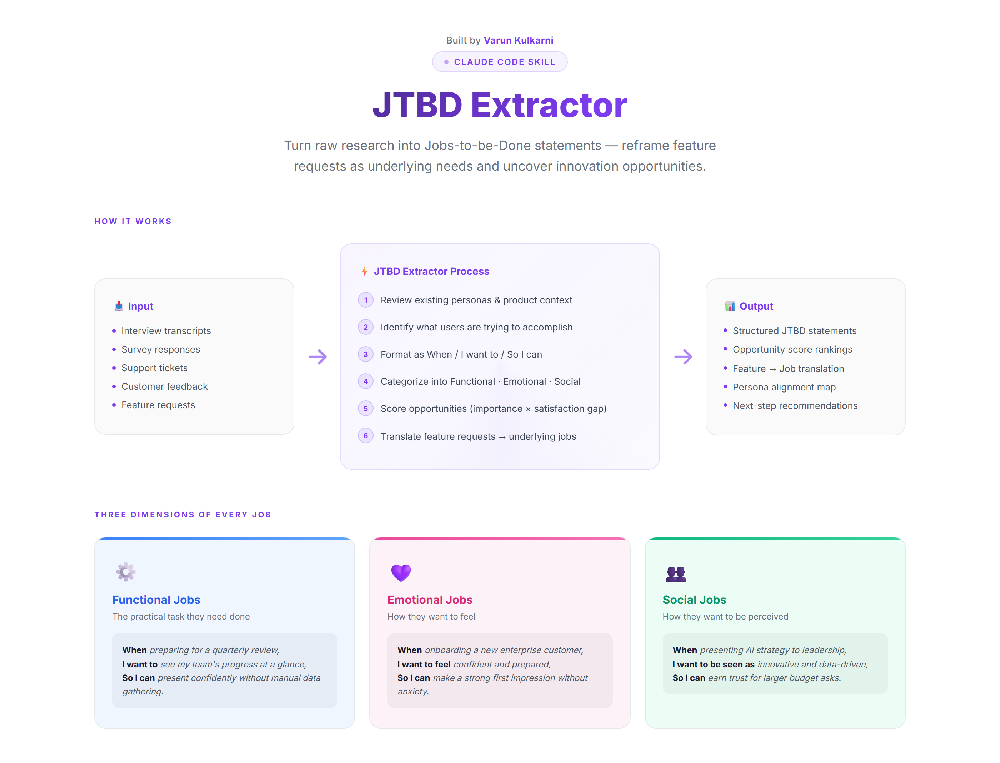

# 🎯 JTBD Extractor

> Turn raw research into Jobs-to-be-Done statements that reveal what users are really trying to accomplish - reframing feature requests as underlying needs and surfacing innovation opportunities worth pursuing.

> Audio interview input is scaffolded — see [docs/AUDIO_INPUT_MODE.md](docs/AUDIO_INPUT_MODE.md). Today the skill expects clean transcript text; the audio adapter seam is documented for later wiring.



[](#installation)
[](LICENSE)
[](https://python.org)
[](https://github.com/varunk130)

---

## ⚡ Quickstart

```bash
# 1. Clone directly into your Claude Code skills directory
git clone https://github.com/varunk130/jtbd-extractor.git ~/.claude/skills/jtbd-extractor

# 2. Restart Claude Code, then in any chat:
/jtbd-extractor
```

Then paste your interview transcripts, support tickets, or NPS verbatims and the skill will surface ranked Functional / Emotional / Social jobs with opportunity scores and supporting evidence.

> 💡 New to Claude Code skills? Full setup, project-local install, and Claude Code Desktop steps are in the [Installation](#installation) section below.

---

## What It Does

The JTBD Extractor is a Claude Code skill that transforms unstructured research data (interviews, surveys, support tickets, feedback) into structured Jobs-to-be-Done analysis.

### Output Includes

| Component | Description |
|---|---|
| **JTBD Statements** | Properly formatted "When [situation], I want to [action], so I can [outcome]" |
| **Job Categories** | Separated into Functional, Emotional, and Social jobs |
| **Opportunity Scores** | `Importance + (Importance - Satisfaction)` to show where to focus |
| **Evidence Tracking** | Direct quotes and behavior supporting each job |
| **Feature Translation** | Mapping what users asked for → what they actually need |
| **Top Opportunities** | Ranked list of underserved jobs worth solving |

---

## Installation

### Global install (available in every project)

```bash
git clone https://github.com/varunk130/jtbd-extractor.git ~/.claude/skills/jtbd-extractor
```

Then restart Claude Code so it picks up the new skill.

### Project-local install (scoped to a single repo)

Clone or copy the folder into your project's `.claude/skills/` directory instead of the global location:

```bash
git clone https://github.com/varunk130/jtbd-extractor.git .claude/skills/jtbd-extractor
```

---

## Usage

In any Claude Code chat, type:

```text
/jtbd-extractor
```

Claude will walk you through the process step-by-step:

1. **Reviews your context** - checks existing personas, product docs, and prior research
2. **Requests research data** - interview transcripts, surveys, support tickets, or feedback
3. **Identifies jobs** - extracts what users are really trying to accomplish
4. **Formats as JTBD** - structures each job as `When / I want to / So I can`
5. **Categorizes** - sorts into Functional, Emotional, and Social jobs
6. **Scores opportunities** - scores importance against satisfaction to surface unmet needs

---

## Example Output

```markdown
### Functional Jobs
| Job Statement | Importance | Satisfaction | Opportunity | Evidence |
|---|---|---|---|---|
| When preparing for a quarterly review, I want to see my team's progress at a glance, so I can present confidently without manual data gathering | 8/10 | 4/10 | 12 | "I spend 3 hours every quarter pulling numbers from 5 different tools" |

### Feature Request Translation
| Request (What They Said) | Job (What They Need) |
|---|---|
| "Add a dashboard" | "Know if I'm on track without manual checking" |
| "Export to PDF" | "Share progress with stakeholders who don't have access" |
```

---

## When to Use

- **Reframing feature requests** as underlying needs
- **Finding innovation opportunities** in saturated markets
- **Training your team** to think in jobs, not features
- **Post-interview synthesis** to extract structured insights
- **Competitive analysis** to find underserved jobs in the market

---

## What You'll Need

- Interview transcripts, survey responses, or customer feedback
- Context on your product/market (optional but recommended)

---

## Framework Reference

**Jobs-to-be-Done**:
- People don't buy products - they hire them to do a job
- Jobs are stable; solutions change
- **Opportunity = Importance + (Importance - Satisfaction)**

---

## Python CLI

Generate visual HTML, Markdown, or JSON reports from JTBD analysis data.

### Install

```bash
pip install -e .
```

### Usage

```bash
# Generate a visual HTML report (opens in browser)
jtbd examples/sample-data.json --open

# Generate Markdown
jtbd examples/sample-data.json -f markdown -o report.md

# Generate enriched JSON with computed scores
jtbd examples/sample-data.json -f json -o report.json
```

### Use as a Library

```python
from jtbd import Job, JTBDAnalysis, render_html

analysis = JTBDAnalysis(
    title="My JTBD Analysis",
    product_context="B2B SaaS platform",
    jobs=[
        Job(
            situation="preparing a quarterly review",
            action="see team progress at a glance",
            outcome="present confidently without manual data gathering",
            category="functional",
            importance=8, satisfaction=4,
            evidence='"I spend 3 hours every quarter pulling numbers from 5 different tools."'
        ),
    ],
)

html = render_html(analysis, author="Your Name")
```

---

## Output Formats

| Format | Command | What You Get |
|---|---|---|
| **HTML** | `jtbd data.json` | Visual report with charts, cards, and scoring |
| **Markdown** | `jtbd data.json -f markdown` | Clean tables for docs/PRDs |
| **JSON** | `jtbd data.json -f json` | Enriched data with computed opportunity scores |

---

## File Structure

```text
jtbd-extractor/
├── README.md                            # This file
├── SKILL.md                             # Claude Code skill definition
├── CHANGELOG.md                         # Notable changes, newest first
├── CONTRIBUTING.md                      # Contribution guide
├── SECURITY.md                          # Security policy and reporting
├── LICENSE                              # MIT license
├── pyproject.toml                       # Python package config
├── docs/
│   ├── AUDIO_INPUT_MODE.md              # Audio adapter design notes
│   └── jtbd-overview.html               # Interactive exec overview visual
├── jtbd/                                # Python package
│   ├── __init__.py
│   ├── models.py                        # Job, Translation, JTBDAnalysis data models
│   ├── renderer.py                      # HTML & Markdown report generators
│   └── cli.py                           # CLI entry point
├── examples/
│   ├── sample-data.json                 # Sample input (JSON)
│   ├── sample-output.md                 # Sample output (Markdown)
│   ├── sample-output.html               # Sample output (visual HTML)
│   ├── sample-jtbd-sales-marketing-finance.md  # Cross-function worked example
│   └── synthetic-interview.md           # Synthetic interview fixture for the walkthrough
└── assets/
    └── jtbd-overview.png                # README screenshot
```

## Tips for Best Results

1. **Keep personas.md updated** — the skill connects new jobs to existing personas
2. **Focus on jobs, not solutions** — "I need a hole" not "Hire a drill"
3. **Look for emotional and social jobs** — they often drive decisions more than functional ones
4. **Validate scores quantitatively** — low-confidence scores from small samples need survey validation

Output is saved to: `discovery/outputs/jtbd-[persona]-[YYYY-MM-DD].md`

---

## Related Work

Part of a portfolio of AI agent and skill libraries for product, GTM, and decision-making teams.

**Discovery & research**

- [ai-customer-discovery-skills](https://github.com/varunk130/ai-customer-discovery-skills) - Turn raw customer signal into validated product opportunities (12 skills planned)

**Strategy & decisions**

- [claude-code-skills](https://github.com/varunk130/claude-code-skills) - 29 production-grade skills for finance, product, strategy, and game theory
- [AI-Builder-Decision-Analyst](https://github.com/varunk130/AI-Builder-Decision-Analyst) - 11 skills that catch bad bets before you ship across DECIDE / BUILD / COMMUNICATE / LEARN

**Go-to-market**

- [ai-gtm-skill-library](https://github.com/varunk130/ai-gtm-skill-library) - 31 opinionated GTM skills across the full discover -> renew lifecycle
- [ai-marketing-claude-skills](https://github.com/varunk130/ai-marketing-claude-skills) - 12 marketing-ops skills with scoring algorithms and statistical frameworks
- [ai-partner-ecosystem-analysis](https://github.com/varunk130/ai-partner-ecosystem-analysis) - Deep research on any ISV, partner, or competitor with a 1-slide PPTX output

**UX & design**

- [ai-ux-skill-library](https://github.com/varunk130/ai-ux-skill-library) - 12 frameworks for designing UX for AI products, agents, and AI-powered experiences

**Multi-agent demos**

- [ai-pm-agents-suite](https://github.com/varunk130/ai-pm-agents-suite) - 6-agent pipeline plus 3 standalone PM agents (decision engine, financial analyst, stakeholder translator) that turn customer feedback into strategy, PRDs, and comms
- [ai-legal-team-agent](https://github.com/varunk130/ai-legal-team-agent) - 4-agent legal analysis team with Python orchestrator and Claude Code skills

**Evaluation & operations**

- [AI-Eval-Skills](https://github.com/varunk130/AI-Eval-Skills) - 6 skills to plan, generate, run, interpret, and triage AI agent evaluations
- [ai-workflow-playbooks](https://github.com/varunk130/ai-workflow-playbooks) - 21 playbooks + 10 skills + 4 guardians + 5 runbooks across the 7-stage delivery pipeline

---

## License

MIT — see [LICENSE](LICENSE) for the full text.

---

Built by [Varun Kulkarni](https://github.com/varunk130) — part of a portfolio of AI agent systems for product teams.
