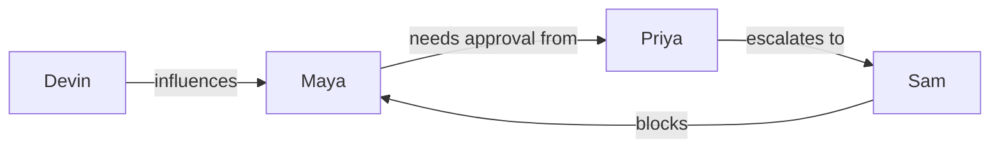

# Basic example: persona-cartographer

## Input
12 interviews across 4 mid-market SaaS finance teams (controllers, FP&A analysts, CFOs, IT security reviewers).

## Expected output (abbreviated)
**Personas**: Maya (Controller), Devin (FP&A Analyst), Priya (CFO), Sam (IT Security)

**Adoption risks**:
1. Sam (IT Security) blocks Maya but has never been a research participant — research gap.
2. Procurement requires Sam→Priya→Maya approval chain (3 hops) — expect 6–10 week sales cycles.